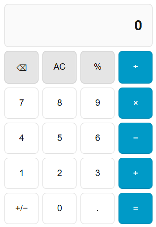

# Calculator Card

[](https://github.com/custom-components/hacs)

A simple calculator for your dashboard.



## Installation

### HACS (Recommended)

1. Make sure [HACS](https://hacs.xyz/) is installed
2. Add this repository as a custom repository in HACS:
   - Go to HACS → Frontend
   - Click the three dots menu → Custom repositories
   - Add repository URL with category "Lovelace"
3. Install the Calculator Card
4. Restart Home Assistant

### Manual Installation

1. Download `calculator-card.js` from the [latest release](https://github.com/schafran/calculator-card/releases)
2. Copy it to `<config>/www/calculator-card.js`
3. Add the resource in Home Assistant:
   - Go to Settings → Dashboards → Resources
   - Add `/local/calculator-card.js` as a JavaScript Module

## Usage

Add the card to your Lovelace dashboard:

```yaml
type: custom:calculator-card
title: My Card
```

### Configuration Options

| Name             | Type   | Default      | Description                                                    |
| ---------------- | ------ | ------------ | -------------------------------------------------------------- |
| `type`           | string | **Required** | `custom:calculator-card`                                       |
| `title`          | string | Optional     | Card title                                                     |
| `entity_id`      | string | Optional     | `input_number` entity to persist result (restores on load)     |
| `color_numeral`  | string | Optional     | Colour for number buttons (hex or HA theme colour)             |
| `color_function` | string | Optional     | Colour for function buttons (AC, %, ⌫)                         |
| `color_operator` | string | Optional     | Colour for operator buttons (+, −, ×, ÷, =)                    |

### State Persistence

To persist the calculator result across refreshes, create an `input_number` helper and configure it:

```yaml
type: custom:calculator-card
title: Calculator
entity_id: input_number.calculator_value
```

The value is restored on load and saved when pressing equals.

## Development

### Dev Container (Recommended)

The easiest way to develop is using the included dev container:

1. Install [VS Code](https://code.visualstudio.com/) with the [Dev Containers extension](https://marketplace.visualstudio.com/items?itemName=ms-vscode-remote.remote-containers)
2. Open the project folder in VS Code
3. Press `Ctrl+Shift+P` → "Dev Containers: Reopen in Container"
4. Wait for the container to build (first time takes ~2-3 minutes)

### Commands

```bash
yarn install    # Install dependencies (automatic on container creation)
yarn start      # Dev server with hot reload (http://localhost:5000)
yarn build      # Lint and build
yarn lint       # Check code quality
yarn rollup     # Production build only
```

### Services

- **Dev Server**: http://localhost:5000 - Live reload development
- **Home Assistant**: http://localhost:8123 - Test environment (user: `dev` / pass: `dev`)

### Testing in Home Assistant

1. In Home Assistant, go to Settings → Dashboards
2. Create a new Dashboard
3. Add the card from the GUI

### Release Process

1. Create a new release on GitHub with a semver tag (e.g., `v1.0.0`)
2. GitHub Actions will automatically:
   - Validate the tag format
   - Update version in `package.json` and `src/consts.ts`
   - Build and attach the JS file to the release

## License

MIT License - see LICENSE file for details
